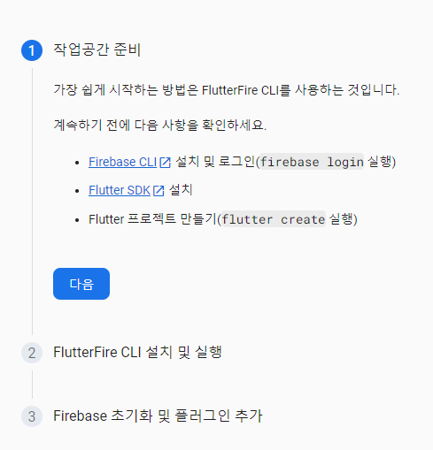

# Flutter firebase 연동 프로젝트

- `auth(인증)`, `firestore(DBMS)`, `real Database(DBMS)` 등을 연동하여 프로젝트를 구현할 수 있다.
- 다른 프로젝트(react 등) 에서는 Hosting 등도 사용할 수 있다

## firebase-auth

- `firebase` 를 통하여 `Email 방식의 회원가입`, `Email 방식의 로그인`을 구현할 수 있다.
- `google login` 등 `oAuth2(인증 Token)` 방식의 인증을 구현할 수 있다

## DBMS 연동 : fireStore, real Database

- `NoSQL` 방식으로 Data CRUD 를 구현할 수 있다
- `1:1` 방식의 채팅 구현
- `Message` 전달 등도 구현

## Flutter 와 firebase 를 연동하기 위하여 사전 도구 설치

- Cli 도구 설치 : `npm install -g firesbase-tools`
- 설치 확인 : `firebase --version`

## firebase 프로젝트 생성하기

- `firebase.google.com` 사이트에서 새로운 프로젝트 생성하기
  
- 생성된 프로젝트에 앱 추가하기 : `flutter 앱 추가`
  

- `firebase-cli` 명령을 실행하여 프로젝트 구성하기
- vscode 에서 윈도우 cmd 창 열기 : `flutterfire` 명령은 윈도우
  cmd 창에서만 실행되기 때문에 cmd 창을 열고 실행해야 한다
- 새로 생성한 프로젝트로 폴더 이동하기 : `cd flutter firebase-008-firebase`

- 프로젝트 폴더에서 config 명령 실행 : `flutterfire configure --project=flutter-my-app-cac24`

- 명령 실행 후 경고가 나오면 시스템 path 에 경로를 등록한다
  `C:\Users\KMS505225\AppData\Local\Pub\Cache\bin`

- cmd 창에서 명령 `flutterfire configure --project=flutter-my-app-cac24` 실행한 후 적용할 대상 선택

## 프로젝트에 defendency 설정하기

- console 화면에서 firebase 플러그인 설정으로 진행하기

- 화면 상단에서 android 선택하고 절차대로 진행

```bash
firebase login
flutter pub add firebase_core
flutter pub add firebase_auth
```

- dependency 를 정상적으로 설치했는데, app 실행에 문제가 발생하는 경우가 있을 수 있다
- dependency 들의 version 이 서로 맞지 않아서 발생하는 경우가 있다. 이때는 다음 명령어로 clean 을 실행한다

```bash
flutter pub upgrade outdated package
flutter clean
flutter pub get
```

## 배포시 Dex 오류 발생하는 경우

- `project/androind/app/build.gradle` 파일을 찾는다
- 파일에서 `defaultConfig` 항목을 찾는다
- `multiDexEnabled true` 추가`
